# 자동화 도구 비교 구현 보고서 ( 프로젝트 1 )

## 1. 워크플로우 개요
- 워크플로우 이름: 날씨 기반 Discord 우산 알림 자동화
- 목적(어떤 반복 업무를 자동화?): 매일 아침 날씨(강수확률)를 자동 조회하여
  비 예보 시 Discord로 우산 알림을 보내는 반복 업무 자동화
- 전체 흐름 한 줄 요약:
  매일 7시 스케줄 실행 → 날씨 API 조회 → 강수확률 조건 분기 → Discord 알림 전송

## 2. 도구별 구현

### [도구 A: n8n]
- Trigger: Schedule Trigger (매일 오전 7시 실행)
- 조건 분기(Filter/Router): If 노드 (강수확률 50% 기준 true/false 분기)
- Action 1: HTTP Request1 → Discord Webhook POST
  (true: "강수확률은 ~%입니다. 우산을 챙기세요")
- Action 2: HTTP Request2 → Discord Webhook POST
  (false: "강수확률은 ~%입니다")
- 구현 화면 캡처: 
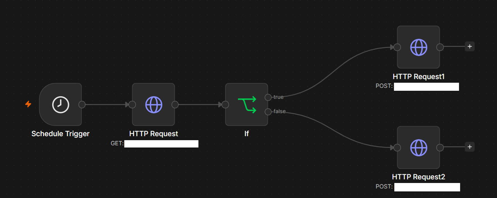 
- 실행 결과 캡처: 
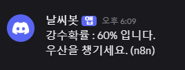
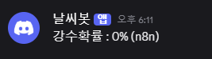
### [도구 B: Make]
- Trigger: Schedule (매일 오전 7시 실행)
- 조건 분기(Filter/Router): Router + 필터 2개
  (1st: 강수확률 50% 이상 / 2nd: 강수확률 50% 미만)
- Action 1: Discord Webhook POST
  (1st: "강수확률은 ~%입니다. 우산을 챙기세요")
- Action 2: Discord Webhook POST
  (2nd: "강수확률은 ~%입니다")
- 구현 화면 캡처: 
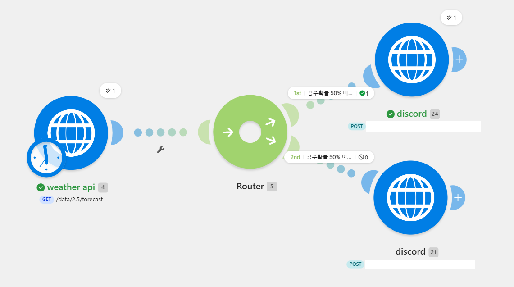
- 실행 결과 캡처: 
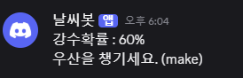

## 3. 비교 분석표

| 비교 항목 | 도구 A (n8n) | 도구 B (Make) |
|-----------|--------------|--------------|
| UI/UX | 노드 기반, 좌→우 흐름. 개발자 친화적이고 직관적 | 원형 모듈 + 곡선 연결. 시각적으로 화려하고 직관적 |
| 설정 난이도 | If 노드/HTTP 직접 설정 필요, 다소 기술적 | Router와 필터가 GUI로 명확, 초보자에게 쉬움 |
| 연동 서비스 범위 | 400+ 통합, 오픈소스라 커스텀 노드 확장 가능 | 1500+ 앱 통합, 사전 구성된 모듈 풍부 |
| 무료 플랜 범위 | 셀프 호스팅 시 무제한(무료), 클라우드는 유료 | 무료 1,000 operations/월, 시나리오 2개 제한 |
| 실행 로그 확인 방식 | Executions 탭에서 노드별 입출력 데이터 상세 확인 | 각 모듈에 실행 횟수 뱃지 표시, History에서 확인 |
| 조건 분기 방식 | If 노드로 true/false 이분기 | Router로 다중 경로 + 경로별 필터 설정 |

## 4. 각 도구의 장단점
- 도구 A(n8n) 장점: 셀프 호스팅 시 무료로 무제한 사용 가능, 오픈소스라
  커스터마이징 자유도 높음, 노드별 데이터 흐름 디버깅 용이
- 도구 A(n8n) 단점: 초기 설정/서버 관리 필요, HTTP 요청 등 수동 설정이 많아
  비개발자에게 진입장벽 있음
  
- 도구 B(Make) 장점: 직관적인 GUI로 초보자도 쉽게 구현, 사전 구성된 앱 모듈이
  많아 빠른 연동 가능, 시각적으로 흐름 파악이 쉬움
- 도구 B(Make) 단점: 무료 플랜의 operations/시나리오 제한, 사용량 증가 시
  유료 전환 부담, 세밀한 커스텀은 한계

## 5. 상황별 추천 의견
- 서버 운영이 가능하고 대량·복잡한 자동화를 비용 없이 운영하려는 상황에서는
  도구 A(n8n)가 적합하다. 왜냐하면 셀프 호스팅 시 실행 횟수 제한 없이
  무료로 사용할 수 있고 커스터마이징 자유도가 높기 때문이다.
- 코딩 경험이 적고 빠르게 소규모 자동화를 만들고 싶은 상황에서는
  도구 B(Make)가 적합하다. 왜냐하면 GUI가 직관적이고 사전 구성된 모듈로
  손쉽게 연동할 수 있기 때문이다.

## 6. (해당 시) 유료 기능 사용 여부
- 사용한 유료 기능: 없음
- 불가피했던 이유 / 무료 대안: 두 도구 모두 무료 플랜 범위 내에서 구현.
  n8n은 셀프 호스팅으로, Make는 무료 operations 한도 내에서 처리 가능했음

## 7. 보너스 - n8n AI 노드 심화 구현

### 구현 목표
기존 워크플로우에 AI를 결합하여, 정형화된 안내 문구가 아닌
날씨 상황에 맞는 자연스러운 코멘트를 자동 생성해 Discord로 전송한다.

### 사용 기술
- AI 모델: Google Gemini Flash
- 연동 방식: Google AI Studio에서 API 키 발급 후
  n8n의 AI 노드에 자격증명(Credentials)으로 연결

### 워크플로우 흐름 (분기 제거 버전)
스케줄 트리거(매일 7시) → HTTP Request(날씨 API 조회)
→ AI 노드(Gemini Flash로 날씨 코멘트 생성) → Discord Webhook 전송

※ 기존 강수확률 조건 분기(If 노드)를 제거하고,
  AI 노드가 항상 실행되어 매번 코멘트를 생성하도록 단순화함.

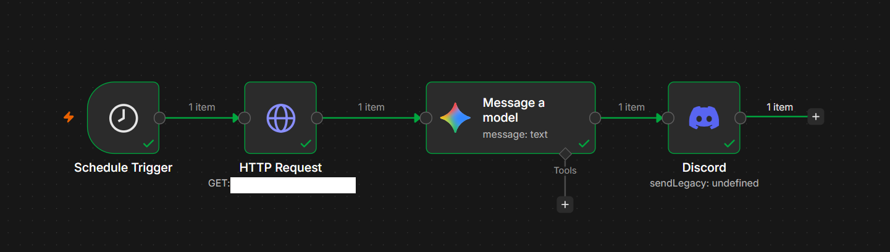

### 구현 방식
- HTTP Request 노드의 날씨 API 응답값을 AI 노드 프롬프트에
  표현식(`{{ }}`)으로 직접 주입
- Gemini Flash가 실시간 데이터를 바탕으로 자연스러운
  한국어 코멘트 1개 버전을 생성
- 생성된 코멘트를 Discord 메시지 본문에 매핑하여 전송

### 실제 사용 프롬프트

다음 날씨 정보를 받아서 1개 버전의 날씨 코멘트를 한국어로 작성해줘. 답변할 때 날씨 코멘트에 대해서만 답해.

날씨: {{ $json.list[0].weather[0].main }}
강수확률: {{ Math.round($('HTTP Request').item.json.list[0].pop *100)}}%
기온: {{ Math.round($('HTTP Request').item.json.list[0].main.temp )}}°C

### 프롬프트 설계 포인트
- `$('HTTP Request')`로 이전 노드의 응답 데이터를 직접 참조
- `Math.round()`로 강수확률(pop×100)과 기온을 깔끔한 정수로 가공
- "날씨 코멘트에 대해서만 답해" 지시로 불필요한 부연 설명을 제거하여
  Discord에 바로 쓸 수 있는 깔끔한 출력 유도

### 구현/실행 결과 캡처
- 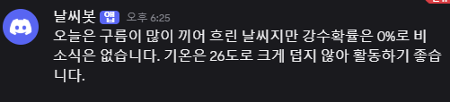

### 심화 학습 포인트
- 기존 정적 메시지("강수확률은 ~%입니다")와 달리, AI가 실시간 데이터를
  바탕으로 동적 코멘트를 매번 새롭게 생성 → 사용자 경험 향상
- n8n 표현식(`{{ }}`)으로 노드 간 데이터를 참조·가공하는 방법 학습
- API 키를 자격증명(Credentials)으로 안전하게 관리하는 방법 학습
- Gemini Flash는 빠른 응답 속도와 무료 할당량으로 자동화에 적합

# 자유 주제 자동화 설계 및 구현 ( 프로젝트2 )

## 1. 반복 업무 정의
- 어떤 업무인가: 달러 환율(USD/KRW)과 비트코인 시세(KRW)를 주기적으로 확인하고,
  이전 확인 시점 대비 변동률을 계산하여 변동 폭에 따라 등급을 나누어
  Discord 채널로 시세 알림을 공유하는 업무
- 얼마나 자주 반복되는가: 1시간마다 (하루 24회)
- 수작업 시 소요 시간: 1회 약 2~3분 (환율/코인 사이트 확인 + 이전 값과 비교 + 메시지 작성)

## 2. 도구 선정
- 선정한 도구: n8n
- 선정 이유(2~3가지):
  1. HTTP Request 노드로 환율 API(exchangerate-api.com)와 코인 API(coingecko)를
     동시에 호출하고 Merge 노드로 손쉽게 결합할 수 있음
  2. Code 노드(JavaScript)를 통해 이전 값과의 변동률 계산 같은 커스텀 로직을
     자유롭게 구현할 수 있음
  3. Google Sheets 노드로 매 실행 시점의 값을 누적 기록해두면, 다음 실행에서
     "이전 값"을 별도 DB 없이 시트 하나로 관리할 수 있음
  4. Switch 노드로 변동률 구간별 알림 등급을 분기해 서로 다른 Discord 채널로
     보낼 수 있음

## 3. 워크플로우 설계
- Trigger: Schedule Trigger - 1시간마다 자동 실행
- 조건 분기: Switch - 변동률(usdChange, btcChange) 기준 3단계 분기
  - 경보: 변동률 ±3% 이상
  - 주의: 변동률 ±1% 이상 ~ 3% 미만
  - Fallback: 변동률 ±1% 미만 (또는 첫 실행으로 비교 대상 없음)
- Action 1: HTTP Request - 환율 API 조회 (GET https://open.er-api.com/...)
- Action 2: HTTP Request - 코인 API 조회 (GET https://api.coingecko.com/...)
- Action 3: Merge - 환율/코인 응답 결합
- Action 4: Google Sheets(read) - 직전 실행에서 저장해둔 이전 환율/비트코인 값 조회
- Action 5: Code in JavaScript - 현재값과 이전값을 비교해 변동률(%) 계산,
  이전 값이 없으면(첫 실행) isFirst 플래그로 별도 처리
- Action 6: Switch - 계산된 변동률을 기준으로 경보/주의/Fallback 3개 경로로 분기
- Action 7: Discord / Discord1 / Discord2 - 분기별로 각각 다른 채널에 시세 알림 전송
- Action 8: Google Sheets(Append row in sheet) - 이번 실행의 날짜, 시간,
  환율, 비트코인 시세를 새 행으로 저장 (다음 실행의 비교 기준값이 됨)
- (흐름 설명)
  1) 1시간마다 스케줄 트리거 발생 →
  2) 환율 API와 코인 API를 동시에 호출 후 Merge로 결합 →
  3) Google Sheets에서 직전 실행 때 저장해둔 이전 값을 조회 →
  4) Code 노드에서 현재값 vs 이전값 변동률(%) 계산
     (이전 값이 없으면 첫 실행으로 처리) →
  5) Switch 노드에서 변동률 크기에 따라 경보(3%↑) / 주의(1%↑) / Fallback 경로로 분기 →
  6) 분기 결과에 맞는 Discord 채널로 시세 알림 전송 →
  7) 이번 실행의 값을 Google Sheets에 새 행으로 추가하여 다음 비교의 기준값으로 사용

## 4. 구현 & 실행 결과
- 구현 화면 캡처: (n8n 워크플로우 캔버스 이미지 - Schedule → HTTP Request(환율/코인) →
  Merge → Google Sheets(read) → Code in JavaScript → Switch → Discord/Discord1/Discord2,
  Code 노드 하단에서 Append row in sheet로 기록)
  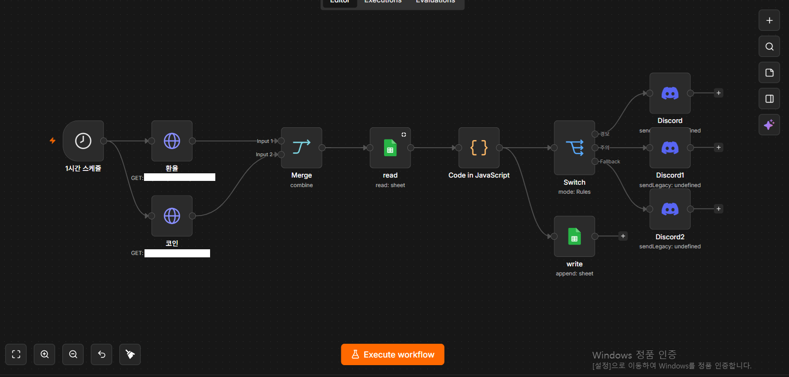
- 실행 결과 캡처: (Discord 알림 결과 이미지, Google Sheets 기록 결과 이미지)
- 조건 분기 각 경로 실행 확인:
  - 경로 A(변동률 3% 이상): Switch "경보" 경로 실행 → 해당 Discord 채널 알림 전송 성공
  - - 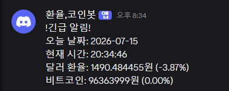
  - 경로 B(변동률 1% 이상 3% 미만): Switch "주의" 경로 실행 → 해당 Discord 채널 알림 전송 성공
  - - 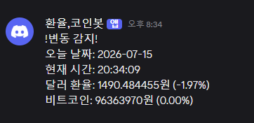
  - 경로 C(변동률 1% 미만 / 첫 실행): Switch "Fallback" 경로 실행 → 일반 알림 전송 성공
  - - 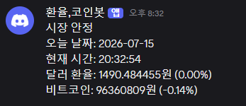
  - 스프레드시트 
  - 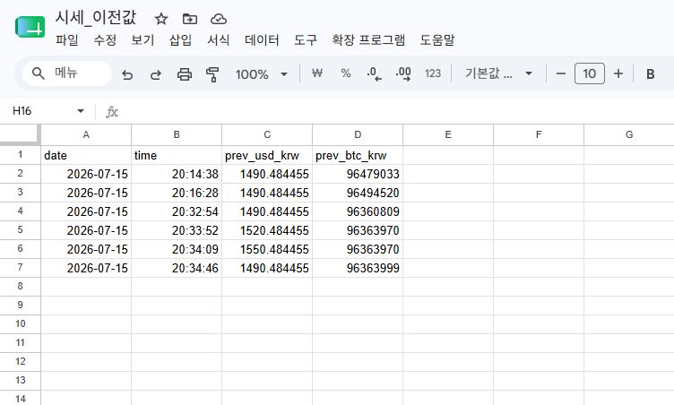
